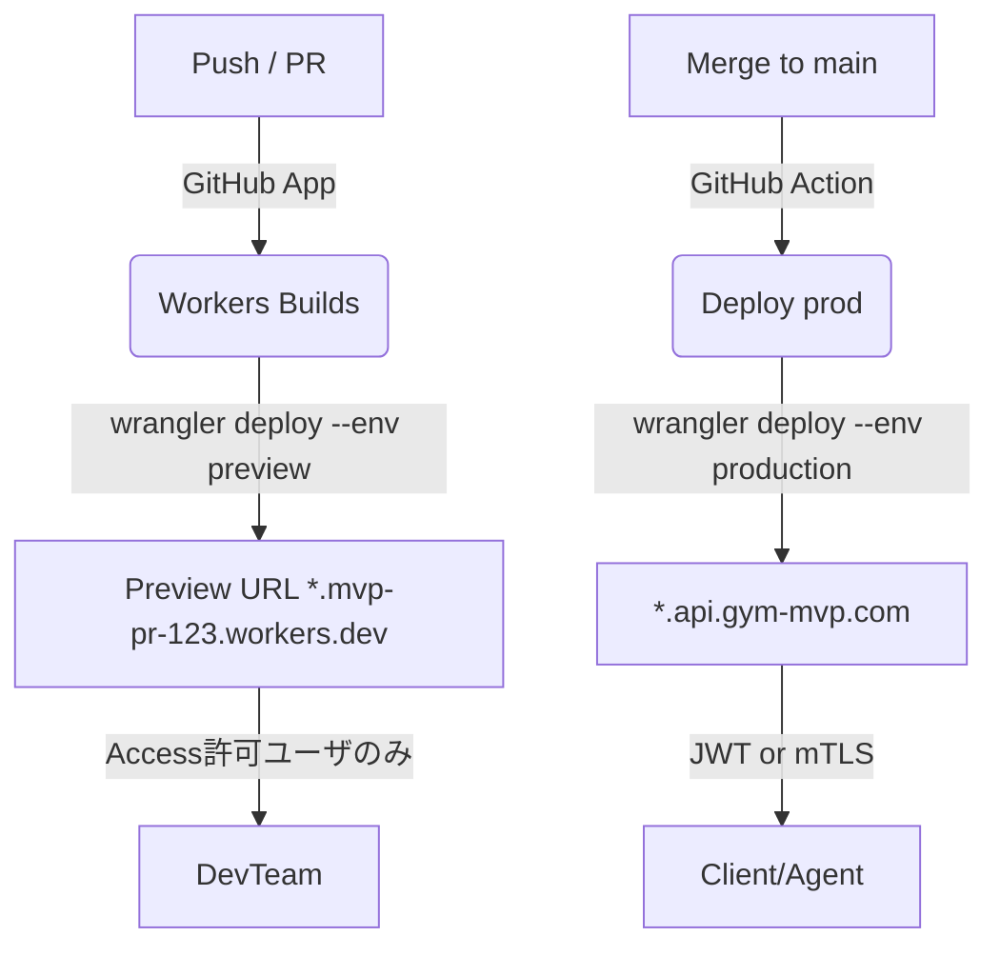

# デプロイフロー & アクセス制御

## 1. 背景

* **モノレポ (apps/web・worker・agent)** を GitHub で管理し、  
  Cloudflare Workers/Pages へ **Preview → Production** の 2 段階デプロイを自動化したい。  
* Preview 環境は内部メンバーのみ検証できれば十分。  
  Production は外部公開だが、**API と AI Agent (Durable Object)** は  
  *IP 制限できない Edge ランタイム* 上にあるため、**Zero Trust / mTLS / JWT** で保護する。

---

## 2. 決定

### 2.1 ビルド & デプロイ基盤

| コンポーネント | 採用 | 理由 |
|----------------|------|------|
| **CI/CD** | **Workers Builds (GitHub Integration)** | プロジェクト単位で “build ✓ / preview URL” を PR にポスト。1 Repo 内に複数 Worker があっても **Check Run が分離**し競合しない (monorepo 対応)。 citeturn2search0 |
| **wrangler.toml** | `env = { preview, production }` | `name = "mvp-${env}"`, `d1_databases = [ { binding, database_id } ]` により DB と KV を環境別に自動プロビジョニング。 |
| **GitHub Workflow** | Cloudflare 提供 **wrangler‑action** で補完 | ローカル E2E を回したあと `wrangler deploy --env ${{ matrix.env }}`。PR ブランチへの push では `--env preview`、`main` マージで `--env production`。 |

### 2.2 Preview ⇆ Production のフロー



* Preview URL は自動的に **PR コメント**と**Check Run**に記載。 citeturn2search3turn2search4  
* D1 の DB 名は `mvp_preview_XXXX`, `mvp_prod` 等で衝突回避。  
  Branch 毎に preview を作り捨てても D1 は課金対象外 (プレビュー DB は TTL 48 h)。

### 2.3 ネットワーク & 認可

| レイヤ | 手段 | ポリシー |
|--------|------|----------|
| **Preview** | **Cloudflare Access**<br> (ZTNA) | サブドメイン `*.mvp-pr-*` を **Access Application** に紐付け、<br>`Include => GitHub Organization Group` のみ許可。 |
| **Production** <br>API / Agent | ① **Access Service Token** — Worker ↔ Agent の H2C 呼び出しに `CF-Access-Client-Id/Secret` を付与。 citeturn3search0 <br>② **JWT Validation** — 外部クライアントには `Cf-Access-Jwt-Assertion` を渡し、Worker 側で公開鍵検証。 citeturn3search8 |
| **mTLS (任意)** | 高権限 API (会員一括登録など) は **mTLS** を有効化しクライアント証明書必須に。 |

> **注**: Access で保護された複数サブドメイン間は SSO Cookie (`CF_Authorization`) が共有されるため、  
> チャット UI (web) → API 呼び出しでも再認証は不要。 citeturn3search3

---

## 3. 実装詳細

### 3.1 wrangler.toml 雛形

```toml
name = "mvp"
main = "src/index.ts"
compatibility_date = "2025-04-20"

[env.preview]
name = "mvp-${{branch}}"
routes = [ "preview-*.<ACCOUNT>.workers.dev" ]
d1_databases = [{ binding = "DB", database_name = "mvp_preview_${{branch}}" }]

[env.production]
routes = [ "api.gym-mvp.com/*" ]
d1_databases = [{ binding = "DB", database_name = "mvp_prod" }]
```

* GitHub App が **branch 名変数**を自動供給し、Preview 毎に固有の Worker 名を生成。  
* `wrangler deployments list` で古い Preview を TTL 後に **Bulk Delete** 可能。

### 3.2 GitHub Action 断片

```yaml
name: Deploy
on:
  push:
    branches: [ main ]
  pull_request:

jobs:
  deploy:
    runs-on: ubuntu-latest
    strategy:
      matrix:
        env: ${{ github.ref == 'refs/heads/main' && 'production' || 'preview' }}
    steps:
      - uses: actions/checkout@v4
      - uses: cloudflare/wrangler-action@v3
        with:
          workingDirectory: apps/worker   # monorepo OK
          apiToken: ${{ secrets.CF_API_TOKEN }}
          command: wrangler deploy --env ${{ matrix.env }} --var GIT_SHA=${{ github.sha }}
```

* monorepoの場合 `workingDirectory` で衝突せず並列実行。  
* `wrangler deployments promote` を使うと **Blue/Green** 切り替えも将来容易。

### 3.3 Access Policy (Zero Trust UI or Terraform)

```hcl
resource "cloudflare_access_application" "preview" {
  name = "GymMVP‑Preview"
  domain = "preview-*.gym‑mvp.com"
  session_duration = "24h"
}

resource "cloudflare_access_policy" "preview_allow" {
  application_id = cloudflare_access_application.preview.id
  precedence = 1
  decision = "allow"
  include {
    github {
      name = "my‑org"
      role = "member"
    }
  }
}
```

* Production API 用には `policy = service_auth` で **Service Token** を生成し、  
  Worker から `fetch(url, { headers })` でヘッダ自動付与。

---

## 4. 採用しなかった代替案

| 案 | 理由 |
|----|------|
| **GitHub Actions のみで wrangler deploy** | Workers Builds なら *Preview URL コメント* が自動生成され運用コスト減。 |
| **Basic 認証 on Preview** | Edge での Auth 処理がコードに混じり冗長。Access なら UI もIP 制御も一括。 |
| **Route Prefix による環境分割** | `api‑stg.gym‑mvp.com` など別ドメインは簡単だが、Access と DNS を毎回追加する手間が増える。 |

---

## 5. 影響

* **安全なマルチ環境** — Preview は外部非公開、Production は JWT/mTLS で最小権限アクセス。  
* **CI/CD 可観測性** — PR 画面から Preview を即確認、Check Run とログが 1 画面に統合。  
* **運用コスト** — Access & Workers Builds は合計 \$7/月 程度 (Access ≒ \$0, Workers有料 \$5, Logs \$2)。  

---

## 6. 今後の検証タスク

| 期日 | 項目 | 成功基準 |
|------|------|----------|
| **〜4月末** | *Preview Policy* テスト | 外部 IP から 403、GitHub org メンバは 200 |
| **5月中旬** | *Service Token 呼び出し* | Worker→Agent 呼び出しが 99%<80 ms |
| **5月末** | *JWT 署名検証* | 改ざん JWT で 4xx、正規トークンで 200 |
